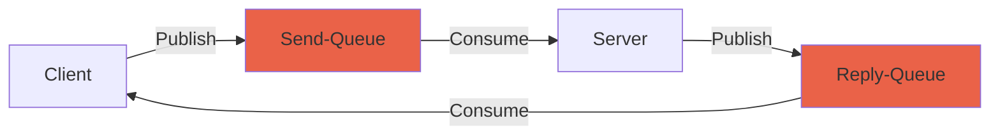

# RabbitCommunicationLib 

A library to assist in developing asycnronous micro-services using RabbitMQ within MentorEngine.


## Transfer Models
When creating a service you need to define at least one TransferModel that implements `ITransferModel`, 
this is used for serialization and de-serialization of data.

There are two models used, `TConsumeModel` and `TProduceModel` for message consumtion and production respectively.

---

## Usage

### 1. Establish a connection with a RabbitMQ Server.

A connection that implements `IQueueConnection` is required for all services - For standard use, instantiating the
`QueueConnection` in `/helpers` is sufficient.

```csharp
var connection = new QueueConnection("amqp://*******", "DD2DD");

```

It is reccomended to pull these variables from the Enviroment. 

```csharp
using RabbitTransfer.Helpers;

public static IHostBuilder CreateHostBuilder(string[] args) =>
	Host.CreateDefaultBuilder(args)
		.ConfigureServices((hostContext, services) =>
		{
		...

		var connection = new QueueConnection(
			hostContext.Configuration.GetValue<string>("AMQP_URI"),
			hostContext.Configuration.GetValue<string>("AMQP_URL_QUEUE"));

		...
```

---

### 2. Create a Service ( Consumer || Producer )

#### Consumer

A Consumer requires you to create a class that inherits from `Consumer<TConsumeModel` class 
and overrides the `HandleMessage` method.

You must supply a `TConsumeModel`.

```csharp
using RabbitTransfer.Consumer;

class ExampleConsumer : Consumer<DC_DD_Model>
{
	public ExampleConsumer(IQueueConnection queueConnection) : base(queueConnection) { }

	protected override void HandleMessage(IBasicProperties properties, DC_DD_Model model)
	{
		Console.WriteLine($"Heres a DownloadUrl: {model.DownloadUrl}");
	}
}

```

#### Producer

A Producer can be instantiated without the need of a parent class.

You must supply a `TProduceModel`.

To produce a message:
- Define a `correlationId<string>` (Usually MatchId)
- Define a  `produceModel<TProduceModel>`

```csharp
using RabbitTransfer.Producer;

...

	// Create the producer using an existing connection
	DemoUrlProducer = new Producer<DD_DC_Model>(queueConnection);

	// Publish a message
	DemoUrlProducer.PublishMessage(matchId, new DD_DC_Model { DemoUrl = "http://mentor.gg/bestdemo.dem" });

```

---

### 2. Create a RPC Service ( RPCConsumer || RPCProducer )

#### RPCConsumer

An RPCConsumer has the similar requirements as the standard Consumer but you must also specifiy a `TProduceModel` for replies.

Instead of overidding the `HandleMessage` method, an RPCConsumer expects you to return a reply of type `TProduceModel` using `HandleMessageAndReply`

```csharp
using RabbitTransfer.Consumer;

class ExampleConsumer : RPCConsumer<DC_DD_Model, DD_DC_Model>
{
    public ExampleConsumer(IQueueConnection queueConnection) : base(queueConnection) { }

	protected override DD_DC_Model HandleMessageAndReply(IBasicProperties properties, DC_DD_Model model)
	{
		Console.WriteLine($"Heres a DownloadUrl: {model.DownloadUrl}");

		...
		
		return new DD_DC_Model { DemoUrl = "http://mentor.gg/bestdemo.dem" }
	}
}

```

#### RPCProducer

An RPCConsumer has the similar requirements as the standard Producer but you must also specifiy a `TConsumeModel` for reply handling.

```csharp
using RabbitTransfer.Producer;

class ExampleProducer : RPCProducer<DC_DD_Model, DD_DC_Model>
{
    public ExampleProducer(IQueueConnection queueConnection) : base(queueConnection) { }

	protected override void HandleReply(IBasicProperties properties, DD_DC_Model model)
	{
		Console.WriteLine($"Heres a DemoUrl: {model.DemoUrl}");
	}
}

```

Invotation is the same as a standard producer.

```csharp

	// Create the producer using an existing connection
	DemoUrlProducer = ExampleProducer(queueConnection)

	// Publish a message
	DemoUrlProducer.PublishMessage(matchId, new DD_DC_Model { DemoUrl = "http://mentor.gg/bestdemo.dem" });


```


---


# Diagrams

## Basic Rabbit Exchange
 ```mermaid
	graph LR
    A((Publisher)) --> B{Exchange}
    B -->  C[Queue]
    C -->|subscribe| D((Consumer)) 

style C fill: #EA6248
style D fill:#6BB7F1
class A publisher;

classDef publisher fill:#84EBFD;

 ```

## RPC Pattern




	