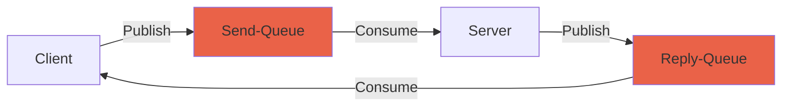

This repo provides abstractions for common rabbit patterns:

currently only the rpc pattern which consists of a client and a server

It also stores all the transfer models, needed to properly decode a sent message.

##Usage##

----

There are two examples in the **examples** folder. These are made for copy-pasting as your rabbit communicator. You need to replace the queue name and implement proper message handling. 

If you are using the _RPC Pattern_, here are abstract classes you can implement to ease your work.
	###RPC Client###
	The abstract class requires the Type of the response model. It handles parsing into the model, so you can use the **HandleReceive()** with the parsed model as a parameter.
	
	Sending a message is done in the **SendNewDemo(long matchId,string demoModel)**, implemented in the abstract class.
	
	You need to specify the Send-Queue and Reply-Queue names.

	###RPC Server###
	This abstract class handles receiving and replying to a message. It gets the Reply-Queue from the ReplyTo-field in the message Header. **You** need to specify the Send-Queue.
	Implement your message handling in the **OnMessageReceived**, adn return the string you want to send back.


##Basic Rabbit Exchange##
 ```mermaid
	graph LR
    A((Publisher)) --> B{Exchange}
    B -->  C[Queue]
    C -->|subscribe| D((Consumer)) 

style C fill: #EA6248
style D fill:#6BB7F1
class A publisher;

classDef publisher fill:#84EBFD;

 ```

##RPC PATTERN##




	